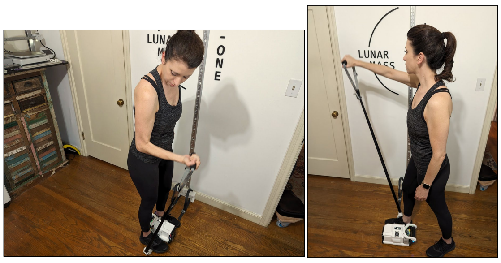
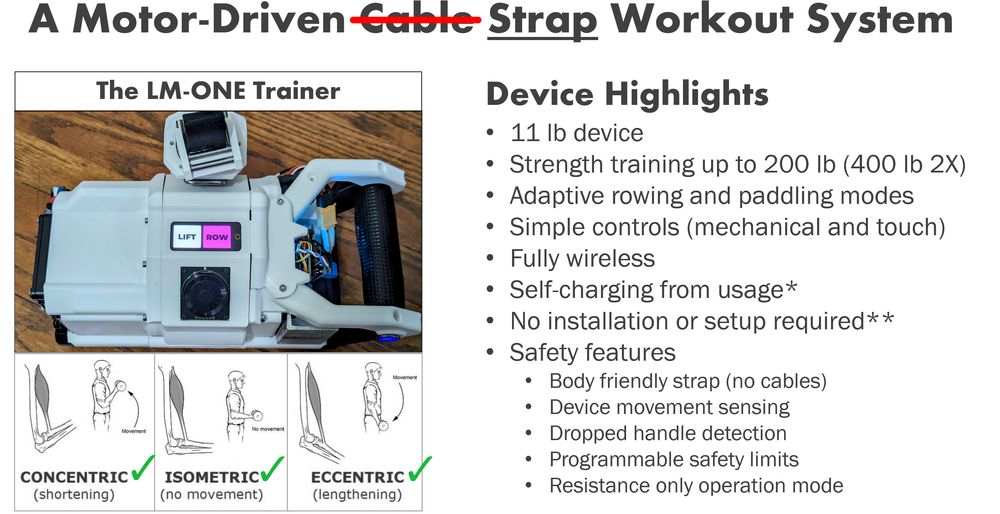
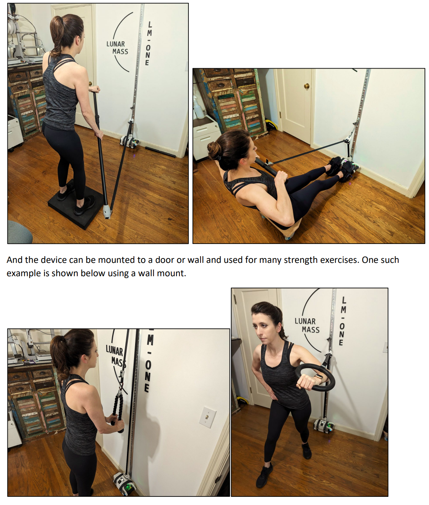
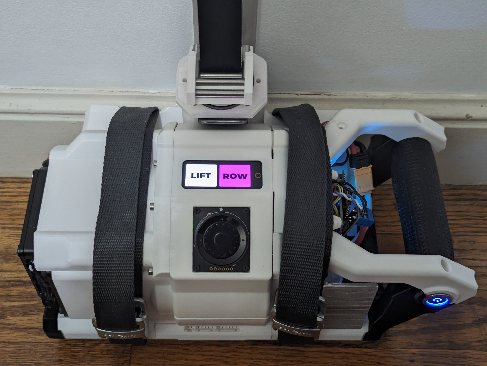
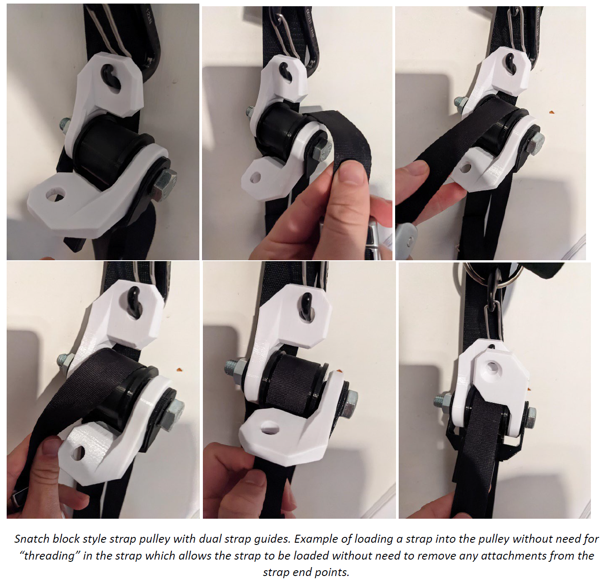
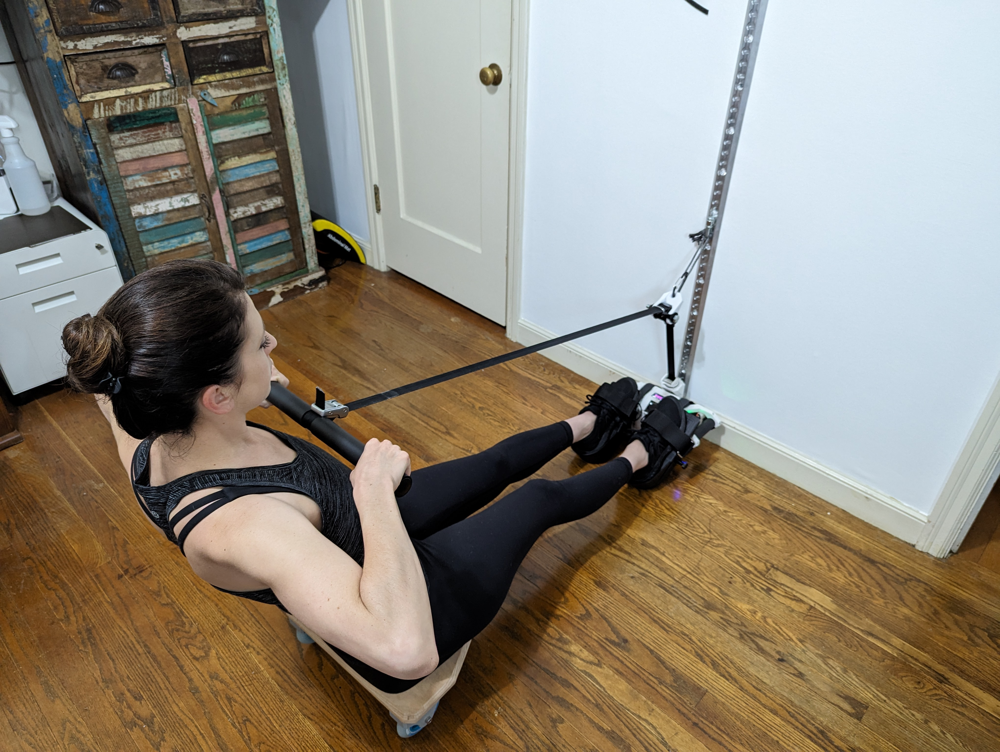
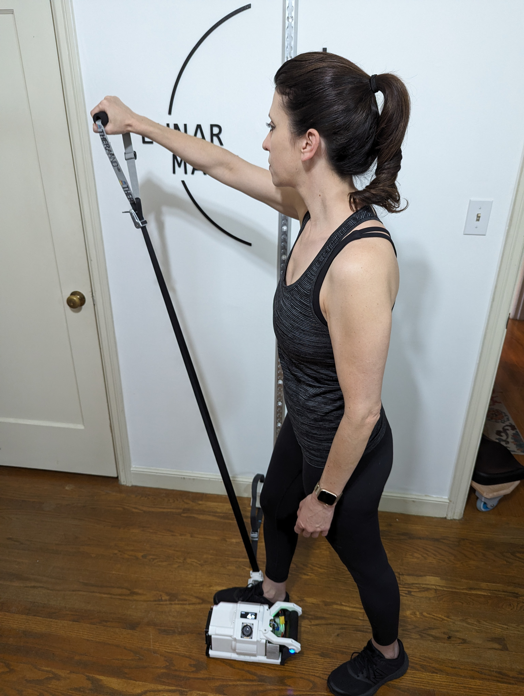
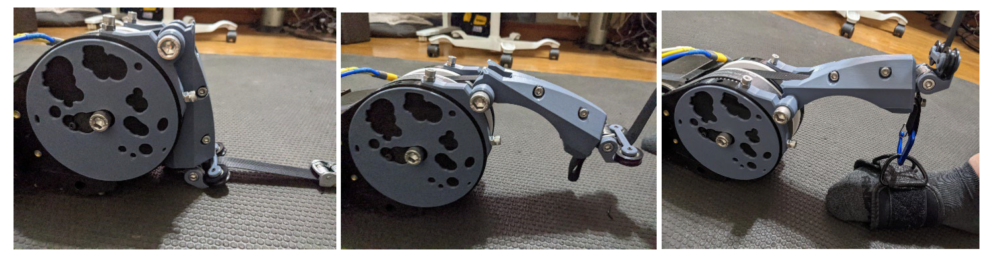
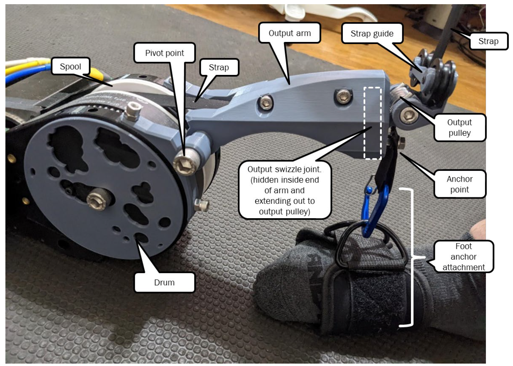

# Project Overview: Open-Source Smart Fitness

Open Workout System is an open-source community creating a high-fidelity smart health/fitness device dedicated to improving your fitness and health. Our primary goal is to develop cost-conscious, accessible, and safe workout systems that cater to a broad audience, from general fitness enthusiasts to individuals undergoing physical therapy. By leveraging open-source principles, we aim to foster a community of developers, fitness professionals, and users who can collaborate to continually improve and expand our solutions.

### V4 Design Readme --> [V4 Design Readme](README_V4DESIGN.md)

### What's Different About This Project/Fitness Solution?

- Completely open source
- 11 lb device that can emulate up to 200 lb (exact specs in design)
- Fully wireless
- Use it anywhere: on the floor, with a door, wall, etc.
- Measures everything you want: power, speed, rep counter, timing
- Benchmarks your fitness
- Tracks your physical therapy progress
- Physical therapists will be able to design and monitor your progress for recovery (remotely and locally)
- Gamify your workout: We're excited to see how this device will be integrated in fun new ways to enhance your routine.

The ultra-compact BLDC motor-driven workout system is our core design focus, aimed at providing a comprehensive, safe, and affordable fitness solution. Traditional workout systems can be intimidating due to their size, complexity, and cost. Our system is ultra-compact and easy to use, ensuring it fits seamlessly into your life. The body-friendly strap enhances safety over a traditional cable system.

### Why Open Source?

As an open-source project, we believe in the power of community and collaboration. By making our designs, code, and documentation freely available, we enable others to contribute to the project, helping to accelerate innovation and bring high-quality fitness solutions to more people. Our commitment to open source ensures transparency, adaptability, and continuous improvement.

Hardware is hard. We want to provide access to a fantastic and safe fitness device for others to build their creative ideas on! Our philosophy is that we make you better, you make us better, and we're all better for it. We know, like us, there are others with great ideas on how to improve their daily routines and unique needs.

### Contribution

We welcome contributions to our project! Whether it's code, hardware designs, documentation, or testing, your input is valuable. To get started please join our Discord Community --> [Open Workout System Discord Server](https://discord.gg/DzmPTt3dUt)
For more information, questions, or collaboration inquiries, please contact us at [aaron.willey+ows@gmail.com].

### Safety and Accessibility

Safety is paramount in our design philosophy. Our Digital Weight Workout System includes features such as device movement sensing, dropped handle detection, and programmable safety limits to ensure a safe workout experience. The lower cost of entry allows a wider audience to access this advanced technology, promoting health and fitness across various demographics. Our goal is to provide a safer and more effective alternative to traditional free weights, reducing the risk of injury and making fitness accessible to all.

## Outline of Project Repositories

- **Digital Weight Device**: The main fitness device central to this project.
- **Applications that communicate with the digital weight**:
  - Web app (simple PWA interface for testing)
  - Mobile app - coming soon
  - Watch app - coming soon
- **Remote device**: Smart controller/remote for the digital weight.
- **Game demos**: Example integration of the device with different games for exploration of use ideas.

### Device Highlights

- **11 lb device**
- **Strength training up to 200 lb (400 lb 2X)**
- **Adaptive rowing and paddling modes**
- **Simple controls (mechanical and touch)**
- **Fully wireless**
- **Self-charging modes**
- **No installation required**
- **Safety features**:
  - Body-friendly strap (no cables)
  - Device movement sensing
  - Dropped handle detection
  - Programmable safety limits
  - Resistance only operation mode

### License

This project is licensed under the terms of the MIT license. See the [LICENSE](LICENSE) file for details.

## Digital Weight Workout System

### Images and Features

#### v4 Pictures

<!-- - 
- 
- 
- 
- 
-  -->

## Older v1_v2_v3 Pictures

<!-- - 
-  -->
