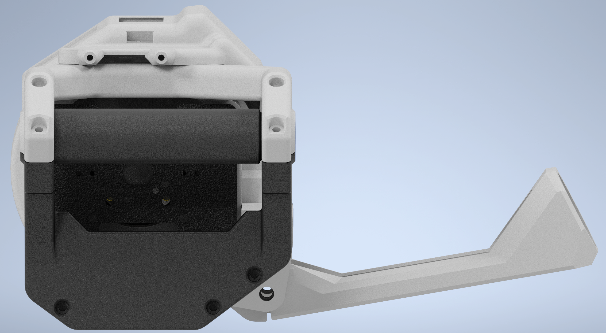
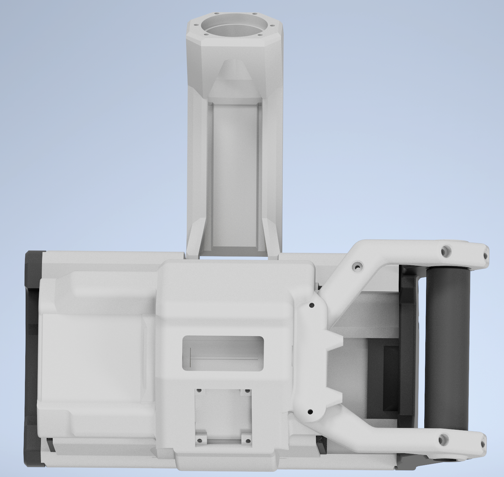

# Digital Weight: V4 CAD

## Release Date

June 2024, as demonstrated at open sauce SF

## Introduction

CAD files to build V4

## Software and tools

- Autodesk inventor and Fusion 360
- Prusa MK3s
- Bambulab A1 (not mini)

## V4 Known Issues and Limitations - CAD related

- **Thermal Management**: Both motors tend to heat up too quickly, indicating a potential thermal issue.
- **Maintenance Challenges**:
  - Difficulty in removing motors with controllers for calibration.
  - Painful removal process for the handle when maintaining the odrive s1 controller.
- **Wiring**: Wire congestion around the device leads to pinched wires, reducing load carrying capacity.

## V4 Image Preview

