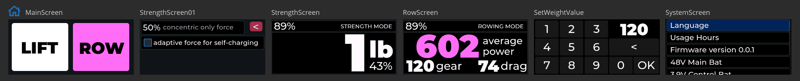
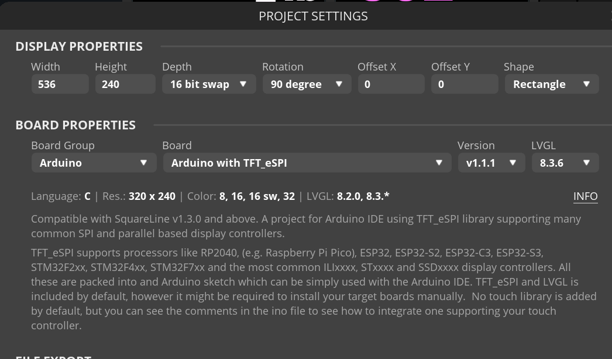

# Embedded GUI for V4 - AMOLED 1p9 Project

## Release Date

June 2024, as demonstrated at open sauce SF

## Overview

- Used squareline 1.3.3 studio for this design (free license version)
- Load the AMOLED 1p9 project
- Strength is functional
- All other screens are a work in progress and will update here when function is complete

## Pending functions

- Functional value input
- Setting mappings to the device
- Row mode
- Enhancements to come for mode and setting changes

## GUI Screens

